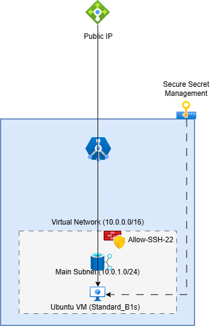

# ☁️ Secure Azure IaaS Infrastructure with Bicep & CI/CD



## 🎯 Project Overview
This project demonstrates an enterprise-grade **Infrastructure as Code (IaC)** workflow. I have designed and deployed a secure, multi-tier Azure environment featuring a Linux Virtual Machine, custom networking, and persistent storage, all validated via a **GitHub Actions CI pipeline**.

## 🏗 Architecture Components
- **Compute (Virtual Machine):** An Ubuntu Linux server (`Standard_B1s`) configured for secure access.
- **Networking:** - **VNet (10.0.0.0/16):** A private isolated network.
  - **Secure Subnet (10.0.1.0/24):** A dedicated segment for infrastructure resources.
  - **Public IP & NIC:** Configured to provide controlled external connectivity to the VM.
- **Security (NSG):** Firewall rules implementing the principle of least privilege:
  - **Port 22 (SSH):** For secure remote management.
  - **Port 80 (HTTP):** For web traffic.
- **Storage:** Azure Storage Account with **HTTPS-only** enforcement and **LRS** redundancy for data persistence.
- **Governance & Protection:** - **Resource Tags:** For cost tracking and organization.
  - **Resource Locks:** `CanNotDelete` lock applied to critical storage components.

## 🛡️ Security & AI Analyst Focus
I implemented specific controls to ensure this infrastructure can safely host **AI models** and sensitive data:
* **🔐 Zero-Trust Secret Management:** Integrated **Azure Key Vault** logic and `@secure()` decorators to decouple sensitive credentials from the deployment logic. This ensures that the Ubuntu VM retrieves its administrative password securely at runtime, preventing secret leakage in source control.
* **🛰️ Micro-Segmentation & Network Hardening:** Implemented **IP Whitelisting** via Network Security Groups (NSG). By restricting SSH (Port 22) to a specific Administrative IP, I effectively eliminated the attack surface for Brute Force and Unauthorized Access.
* **🤖 AI Model Integrity (Inference Node):** Designed as a **Secure Inference Node** to protect ML models from unauthorized exfiltration (**Model Stealing**) or **Data Poisoning** by isolating the compute resource within a dedicated Virtual Network trust boundary.
* **⚖️ Governance & Immutability:** Applied **Resource Locks** and **Resource Tagging** to ensure infrastructure persistence and prevent accidental **configuration drift** or unauthorized deletion of AI data volumes.

## 🛠 Tech Stack
- **Cloud Provider:** Microsoft Azure
- **IaC Tool:** Azure Bicep (Modular & Declarative)
- **CI/CD:** GitHub Actions (Automated Linting & Static Analysis)
- **Security:** Network Security Groups (NSG) & Secure Parameter Handling (`@secure`).

## 🚀 CI/CD Workflow
Every "Push" to the main branch triggers a GitHub Action that:
1. Provisions a temporary environment.
2. Installs the Azure Bicep CLI.
3. Performs a `bicep build` to validate the syntax and integrity of the infrastructure code.

## 🔧 How to Deploy
To deploy this infrastructure, use the following Azure CLI command:
```bash
az deployment group create --resource-group <YourResourceGroupName> --template-file main.bicep
